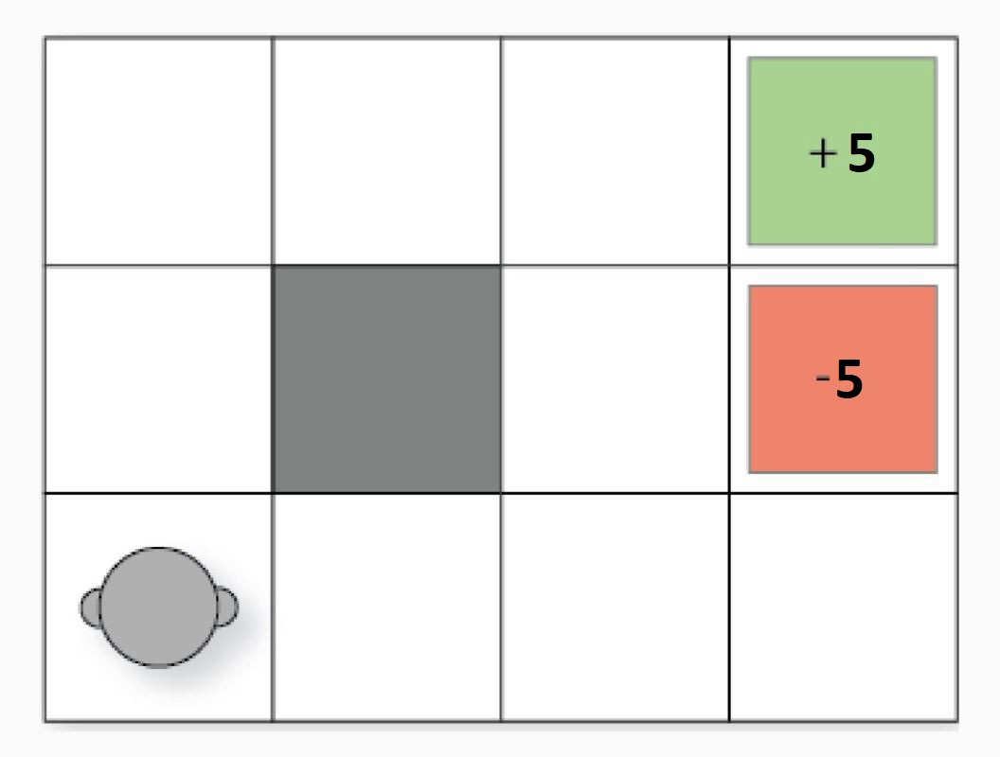

The basics-Gridworld
~~~~~~~~~~~~~~~~~~~~~~~~~~~~~~~~

This is the example that everybody uses to start RL with. It is mandatory : )
Consider a 3x4 grid, the goal of the agent is to start from a position on the grid, and navigate its way to **end: +5**(and not at **end: -5**)

   

In my implementation, I'm giving the agent a reward of -1 if it lands on any other position. 
People usually have a wall at (1,1) (0-indexed notation : ) ), that's up to you. You can put up a wall there too. 

Dynamic Programming
===================

1. **Iterative Policy evaluation:**

In common terms, given a policy, tell me how good it is. 
A state in grid world is the position on the grid. Let's say the policy we want to evaluate has only action that can be taken from a position. This is how the pseudocode would like: 

::

   delta = 0
   while True:
      for s in allStates: # Policy update loop
         cached_V = V[s]
         a = policy[s]
         s2, r = agent.move(s, a)
         V = r + gamma*V[s2]
         delta = max(delta, np.abs(V - cached_V))
      if delta < epsilon:
         break

We break as soon as the max change in one update loop is less than a small value, epsilon

2. **Policy Improvement:**

Great! So we now know how to evalue a policy. But the main goal of RL is to find out the best policy. 
This is pseudocode for policy improvement:

::

   while True:
      evaluatePolicy()
      isPolicyStable = True
      for s in allStates:
         actionAsPerCurrentPolicy = policy[s]

         # The next few lines will try to find the best action to take from current state. 
         values_list = {"L": float(-inf), "R": float(-inf), "D": float(-inf), "U": float(-inf)}
         for a in allPossibleActionsInState[s]:
            s2, r = agent.move(s, a)
            values_list[a] = r + gamma*V[s2]

         newAction = max(zip(values_list.values(), values_list.keys())) # Essentially argmax : )
         if newAction != actionAsPerCurrentPolicy:
            isPolicyStable = False
            currentPolicy[s] = newAction

      if isPolicyStable: break

2. **Monte Carlo**:

"*Sample mean is an estimate of true mean*"

.. math::
   V_\pi(s) = E[G_t|S_t=s] \approx \frac{1}N \sum_{i=1}^{N} G_i,s

Remember the recursive relationship to obtain G?

.. math::
   
   G(t) = r + \gamma*G(t+1)

This is what we're going to use to get the expected value of a state, s.

.. note::
   In an episode, if we only average over the rewards obtained after state s was visited for the first time then it is called First-visit Monte Carlo, and if in an episode, we average over the rewards obtained every time state s is visited we call it Every-visit Monte Carlo.

You play one episode of the game, collect states & rewards. 
Now work backwards i.e. from t = T-1 to 0. 
Using first-visit MC, we just average the returns like so:

::

   for iter in range(maxEpisodes):
      states, rewards = playEpisode(policy)

      T = len(states)
      G = 0
      for t in range(T - 1, -1, -1):
         s = states[t]
         r = rewards[t]
         G = r + GAMMA * G

         # First-visit MC
         if s not in states[:t]:
             returns[s].append(G)
             V[s] = np.mean(returns[s])